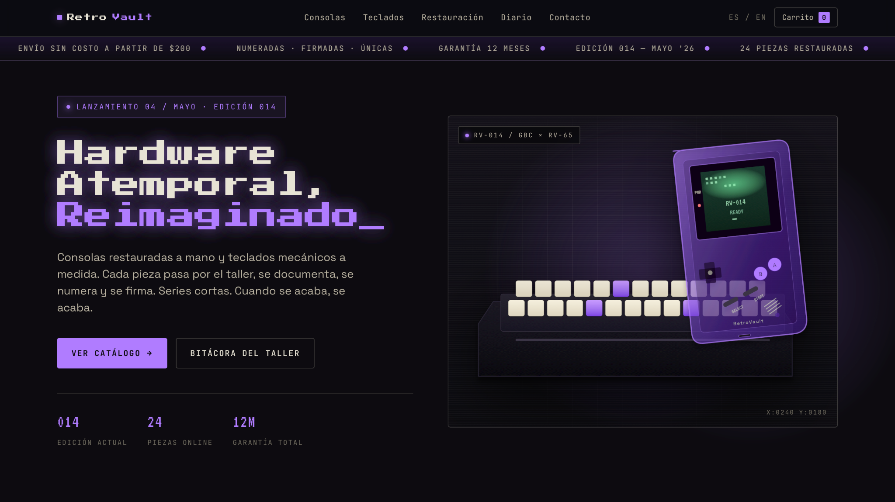

# RetroVault

**RetroVault** es una página web estática para promocionar consolas retro restauradas y teclados mecánicos personalizados. El sitio presenta una experiencia visual de catálogo premium, con estética retro-industrial, productos de edición limitada y secciones informativas sobre restauración, mejoras modernas, testimonios y contacto.

---

## Descripción general del sitio

### Propósito

El propósito del sitio es presentar a RetroVault como una marca especializada en hardware clásico restaurado y periféricos personalizados. La página funciona como un catálogo digital donde el usuario puede conocer los productos disponibles, revisar sus beneficios, entender el proceso de restauración y contactar a la marca para consultas o suscripción a novedades.

### Público objetivo

El sitio está dirigido a personas interesadas en videojuegos clásicos, coleccionismo, estaciones de trabajo personalizadas, teclados mecánicos y estética retro funcional. Su público principal incluye coleccionistas, profesionales de tecnología, creativos digitales y usuarios que buscan productos únicos, restaurados y con mejor calidad que las opciones comunes de segunda mano.

### Alcance

Este proyecto corresponde a una página web estática desarrollada en un solo archivo `index.html`. Incluye estructura HTML, estilos CSS, elementos SVG y una pequeña interacción con JavaScript para el desplazamiento del catálogo. No incluye backend, base de datos, pasarela de pagos, autenticación de usuarios ni carrito funcional conectado a un sistema real.

---

## URL del sitio desplegado

```text
https://josiasperjac.github.io/RetroVault/
```

---

## Captura de pantalla del sitio desplegado



---

## Características principales

### Diseño y estética

- Paleta oscura industrial con fondo carbón, blanco retro y acento púrpura neón.
- Tipografía con estilo retro y tecnológico usando Google Fonts.
- Diseño visual inspirado en catálogos de hardware clásico y productos de edición limitada.
- Efectos visuales como líneas de escaneo, fondos con grid, brillos radiales y detalles tipo CRT.
- Ilustración SVG principal de una Game Boy Color translúcida junto a un teclado mecánico RV-65.

### Navegación principal

El sitio incluye una barra superior fija con navegación hacia las secciones principales:

- Consolas
- Teclados
- Restauración
- Diario
- Contacto

También incluye selector visual de idioma `ES / EN` y un contador de carrito mostrado como elemento visual.

### Secciones del sitio

| # | Sección | Descripción |
|---|---------|-------------|
| 01 | Header | Contiene el logo de RetroVault, navegación interna, selector de idioma y carrito visual. |
| 02 | Marquee | Banda animada con información de edición, número de piezas, envíos y garantía. |
| 03 | Hero | Presenta el mensaje principal: “Hardware Atemporal, Reimaginado”, junto con llamadas a la acción. |
| 04 | Restauración / Beneficios | Explica los tres principios principales: restauración experta, mejoras modernas y estética única. |
| 05 | Catálogo | Muestra un rail horizontal con productos como consolas retro y teclados mecánicos personalizados. |
| 06 | Proceso | Resume el flujo del taller en cuatro pasos: diagnóstico, recap, mejoras y firma. |
| 07 | Testimonios | Presenta opiniones de coleccionistas y profesionales sobre la calidad de los productos. |
| 08 | Footer / Contacto | Incluye newsletter, formulario de contacto, enlaces rápidos, redes sociales y aviso legal. |

---

## Productos representados en el catálogo

| Producto | Tipo | Características | Precio mostrado |
|---|---|---|---|
| GBC · Púrpura Atómico | Consola retro | IPS v3, USB-C, batería | $340 |
| RV-65 · Carbón | Teclado mecánico | Topre 45g, aluminio, MX | $520 |
| GBA SP · Perla | Consola retro | IPS v3, latón | $295 |
| RV-Numpad · Fantasma | Teclado mecánico | MX, translúcido | $180 |
| NES Top-Loader | Consola retro | Restauración clásica | $420 |
| RV-TKL · Siena | Teclado mecánico | Diseño TKL personalizado | $580 |
| Game Gear · Onyx | Consola retro | Restauración y mejoras | $385 |
| RV-60 · Hueso | Teclado mecánico | Diseño compacto premium | $640 |

---

## Tecnologías utilizadas

- **HTML5** para la estructura semántica del sitio.
- **CSS3** para estilos, variables, grid, flexbox, animaciones y diseño responsivo.
- **JavaScript vanilla** para controlar el desplazamiento horizontal del catálogo.
- **SVG inline** para las ilustraciones de productos.
- **Google Fonts** para las tipografías `VT323`, `Press Start 2P`, `Space Grotesk` y `JetBrains Mono`.

---

## Estructura del proyecto

```text
RetroVault/
├── index.html
├── README.md
└── assets/
    └── screenshot-retrovault.png
```

---

## Cómo abrir el proyecto localmente

El proyecto no requiere instalación de dependencias ni proceso de compilación. Solo se debe abrir el archivo `index.html` en un navegador moderno.

En macOS:

```bash
open index.html
```

También se puede abrir manualmente haciendo doble clic sobre el archivo `index.html`.

---

## Interactividad

El sitio incluye interacciones ligeras sin librerías externas:

- Animación infinita en la banda informativa superior.
- Cursor parpadeante en el título principal.
- Pulso visual en el indicador de lanzamiento.
- Desplazamiento suave del catálogo mediante botones.
- Feedback visual al enviar el formulario de contacto.
- Estados `hover` en botones, tarjetas, enlaces y elementos interactivos.

---

## Diseño responsivo

La página utiliza un breakpoint principal en `980px`. En pantallas pequeñas, el hero cambia a una sola columna, los beneficios se reorganizan verticalmente, el proceso pasa a dos columnas y la navegación superior se oculta para mejorar la lectura en dispositivos móviles.

---

## Autor

Proyecto desarrollado por **Josias Pérez Jácome**.

---

## Estado del proyecto

Proyecto académico correspondiente al **Proyecto 01**.  
Estado actual: documentación y mantenimiento del sitio web estático.

---

© 2026 RetroVault · GYE
